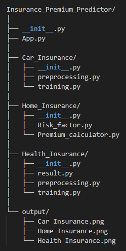
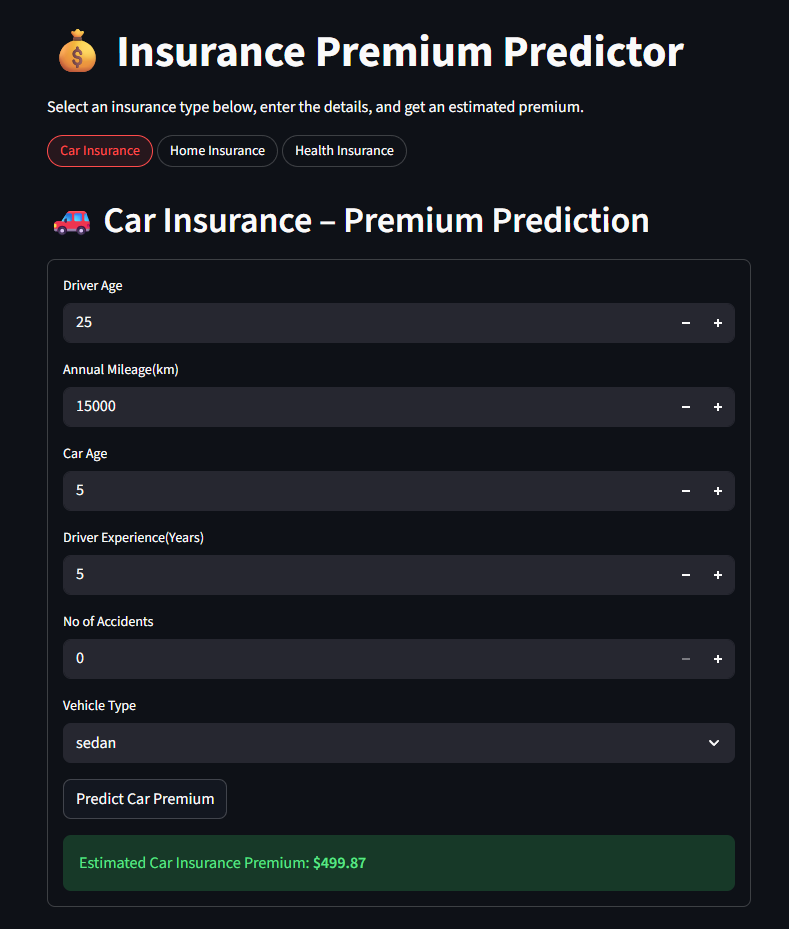
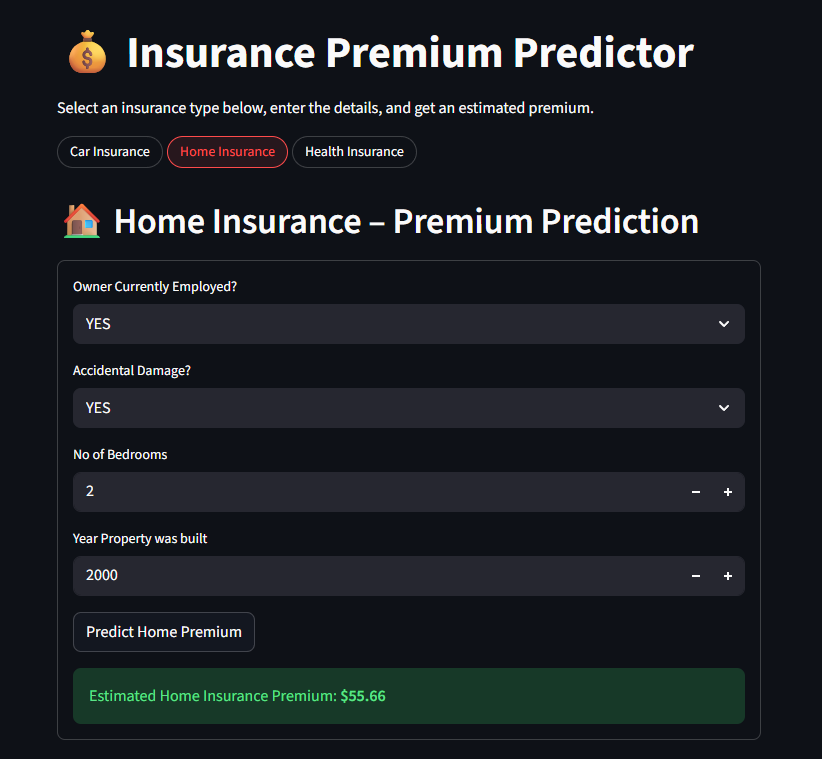
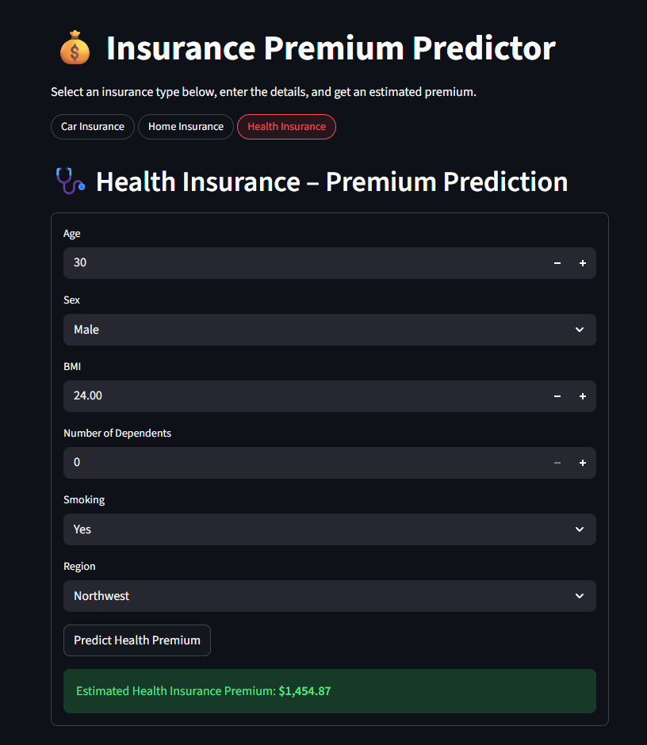

# Insurance Premium Predictor
The Insurance Premium Predictor is a modular machine learning application designed to estimate premiums for car, home, and health insurance through a unified, user-friendly interface. Its primary aim is to provide fast, data-driven predictions based on user-specific risk factors, allowing users to explore how different attributes influence insurance costs. The system features a clean package architecture with separate sub-modules for each insurance product, pre-trained models for rapid inference, and an interactive Streamlit UI that supports customizable inputs and real-time results. By combining modular design, automated prediction pipelines, and an accessible interface, the project demonstrates how machine learning can streamline insurance pricing and enhance decision-making for both users and developers.

The Unit Testing Modules can be found in the Tests folder, the **tests/test_suite.py** folder contains the test suite for all the test classes.

### Requirements - 
- streamlit
- scikit-learn
- pandas
- joblib
- pickle

To run the demo use - `streamlit run App.py`

Sample Outputs 

